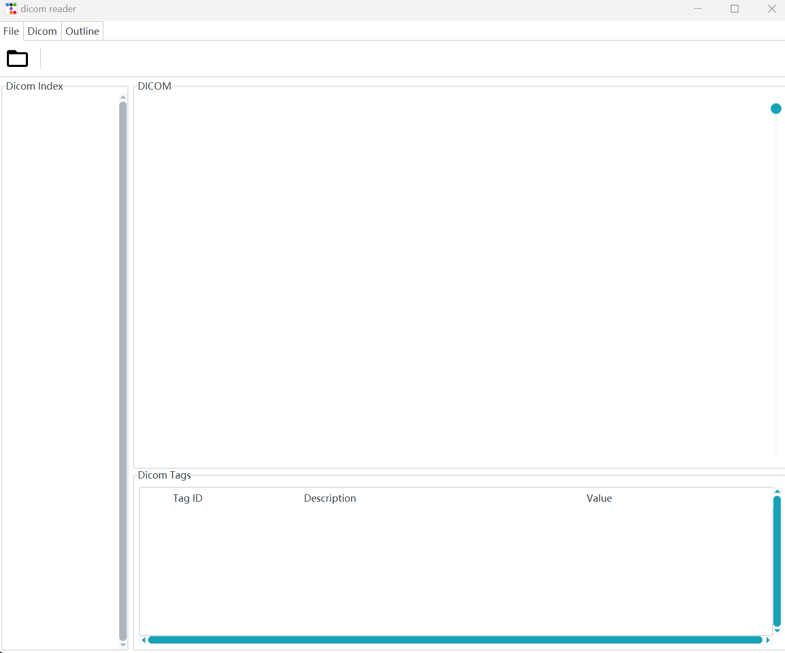
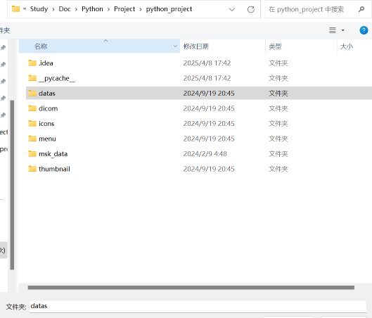
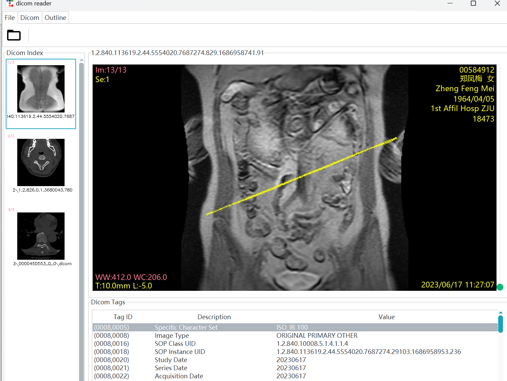
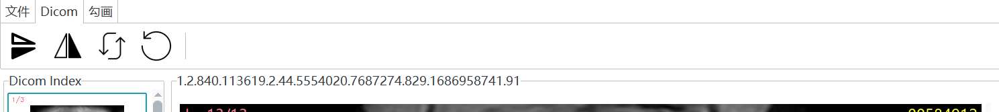

### Quik Start
#### 1. Install dependencies
```bash 
pip install -r requirements.txt
```
#### 2. Run the code
+ Run `main.py`

+ View the GUI like this:  
  

+ Click the button under the file to upload images or drag the file into the window  
  

+ Use the mouse wheel or the up/down arrow keys on the keyboard to switch images.  
    
  *The yellow box indicates the annotated area.*

+ You can use the options under the DICOM menu to make some initial adjustments to the delineation.
    

+ Hold down the middle mouse button and drag to adjust the image's window width and window level.
+ This yellow line is an incorrect annotation and should be deleted(use bottoms under outline) (This feature is not yet implemented)
+ After completing all annotations, save and export the results(not yet implemented)